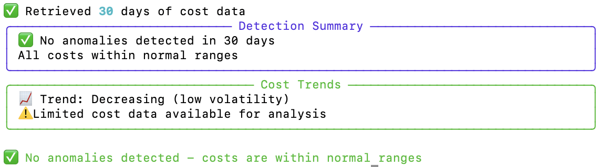
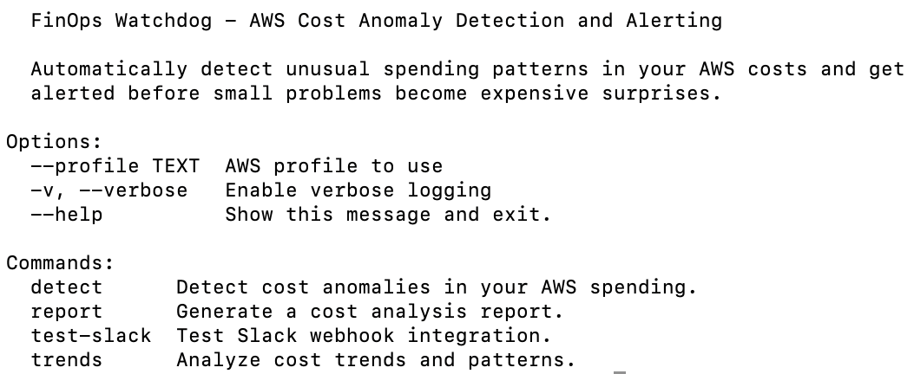
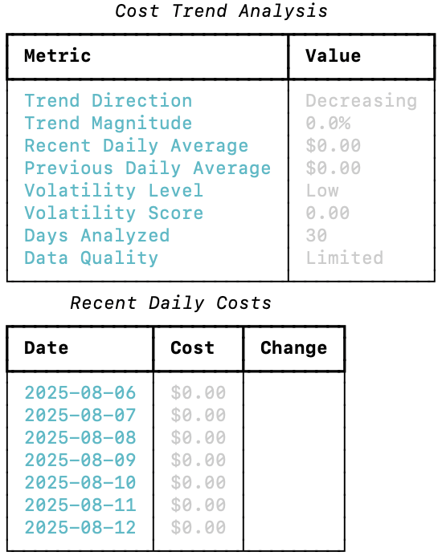

# FinOps Watchdog

**Intelligent AWS cost anomaly detection and alerting** - Catch unusual spending patterns before they become expensive surprises.

[](https://github.com/dianuhs/finops-watchdog/actions/workflows/ci.yml)
[](https://www.python.org/downloads/)
[](https://opensource.org/licenses/MIT)
[](https://github.com/psf/black)

> Proactive cost monitoring that alerts you to anomalies before they impact your budget.

## Overview

FinOps Watchdog is an intelligent AWS cost anomaly detection system that automatically identifies unusual spending patterns using statistical analysis. Built for FinOps teams who need proactive cost monitoring, it detects cost spikes, drops, and service-level anomalies before they become budget problems.

## Why FinOps Watchdog?

Cost surprises are expensive. By the time you notice a spending spike in your monthly bill, the damage is done. FinOps Watchdog continuously monitors your AWS costs using proven statistical methods, alerting you to anomalies within hours instead of weeks. This project demonstrates my understanding of both the technical and business sides of cloud cost management.

## What It Looks Like

*Intelligent anomaly detection with severity classification* <br>


*Professional CLI interface with multiple commands* <br>


*Cost trend analysis and volatility monitoring* <br>


## Sample Output

```bash
$ finops-watchdog detect --days 30 --sensitivity medium
🔍 FinOps Watchdog - Anomaly Detection
📊 Analyzing last 30 days with medium sensitivity...

✅ Retrieved 30 days of cost data
🚨 Found 3 anomalies in 30 days
🔥 1 Critical | ⚠️ 1 High | ⚡ 1 Medium

╭─────────────────────────── Anomaly Details ───────────────────────────────────────╮
│ Date       │ Type        │ Severity │ Service    │ Impact          │ Description  │
├────────────┼─────────────┼──────────┼────────────┼─────────────────┼──────────────┤
│ 2024-12-08 │ Cost Spike  │ CRITICAL │ Amazon EC2 │ $245.67 (+193%) │ Unusual...   │
│ 2024-12-06 │ Cost Spike  │ HIGH     │ AWS Lambda │ $89.23 (+156%)  │ Function...  │
│ 2024-12-03 │ Cost Drop   │ MEDIUM   │ Amazon RDS │ $12.45 (-67%)   │ Service...   │
╰───────────────────────────────────────────────────────────────────────────────────╯

💡 Recommendations:
• Investigate recent infrastructure changes or increased usage
• Check for unintended EC2 instance launches or size changes
• Review Lambda function execution patterns and memory settings
```

## Try It in 30 Seconds

```bash
# Install and run
git clone https://github.com/dianuhs/finops-watchdog.git
cd finops-watchdog
pip install -e .
finops-watchdog detect --days 30
```

## Key Features

### 🔍 **Intelligent Anomaly Detection**
- **Statistical analysis** using z-scores and rolling averages
- **Multi-level detection** for both total costs and service-specific spending
- **Configurable sensitivity** (low/medium/high) for different environments
- **Confidence scoring** to reduce false positives

### 🚨 **Smart Alerting System**
- **Severity classification** (Low/Medium/High/Critical) based on impact
- **Rich console alerts** with actionable recommendations
- **Slack webhook integration** for team notifications
- **Email alerts** (coming soon)

### 📊 **Comprehensive Analysis**
- **Trend detection** (increasing/decreasing costs)
- **Volatility monitoring** to identify unstable spending patterns
- **Service-level breakdown** to pinpoint cost drivers
- **Historical pattern analysis** for accurate baselines

### 🔧 **Professional Tools**
- **Multiple output formats** (console, JSON, YAML)
- **Export capabilities** for further analysis
- **CLI interface** with rich formatting
- **AWS profile support** for multi-account setups

## Real-World Use Cases

**DevOps Team Cost Monitoring**
A DevOps team uses `finops-watchdog detect --sensitivity high` in their CI/CD pipeline to catch cost spikes from infrastructure changes before deployment to production.

**FinOps Daily Standup**
A FinOps analyst runs `finops-watchdog report --days 7` every morning to identify overnight cost anomalies and brief leadership on spending patterns.

**Automated Budget Alerts**
An enterprise sets up `finops-watchdog detect --alert-types slack` as a daily cron job, sending automatic Slack alerts to #finops-alerts when spending exceeds normal patterns.

**Incident Response**
When services go down, teams use `finops-watchdog trends --days 14` to verify that cost drops correlate with service outages, confirming impact scope.

## Installation & Setup

### Install from Source
```bash
git clone https://github.com/dianuhs/finops-watchdog.git
cd finops-watchdog
pip install -e .
```

### AWS Setup
```bash
# Create AWS profile (recommended)
aws configure --profile finops-watchdog

# Enable Cost Explorer in AWS Console
# Go to: AWS Cost Management → Cost Explorer → Enable

# Test installation
finops-watchdog --help
```

## Quick Start

```bash
# Basic anomaly detection
finops-watchdog detect --days 30

# High sensitivity detection
finops-watchdog detect --sensitivity high --days 14

# Generate daily report
finops-watchdog report --days 7

# Analyze cost trends
finops-watchdog trends --days 30

# Export results for further analysis
finops-watchdog detect --export results.json
```

## Advanced Usage

### Anomaly Detection
```bash
# Different sensitivity levels
finops-watchdog detect --sensitivity low     # Fewer false positives
finops-watchdog detect --sensitivity medium  # Balanced detection
finops-watchdog detect --sensitivity high    # Catch smaller anomalies

# Custom time periods
finops-watchdog detect --days 14   # Recent changes
finops-watchdog detect --days 60   # Longer baseline

# With Slack alerts
finops-watchdog detect --alert-types slack --slack-webhook YOUR_WEBHOOK_URL
```

### Reporting & Analysis
```bash
# Daily cost report
finops-watchdog report --days 7

# Weekly trend analysis
finops-watchdog trends --days 30

# Export for automation
finops-watchdog detect --export anomalies.json --days 30
finops-watchdog trends --days 30 > trends.txt
```

### Slack Integration
```bash
# Test Slack webhook
finops-watchdog test-slack --webhook-url YOUR_WEBHOOK_URL

# Automated alerts
finops-watchdog detect --alert-types console,slack --slack-webhook YOUR_URL
```

## How It Works

### Statistical Detection Methods

**Z-Score Analysis**
- Calculates rolling mean and standard deviation
- Identifies costs beyond 2+ standard deviations
- Adapts to seasonal patterns and growth trends

**Threshold-Based Detection**
- Percentage deviation from expected costs
- Configurable sensitivity levels
- Minimum impact thresholds to reduce noise

**Service-Level Monitoring**
- Analyzes each AWS service independently
- Detects service-specific anomalies
- Correlates service spikes with total cost impact

### Alert Severity Levels

- **🔥 Critical**: >100% deviation or >3 standard deviations
- **⚠️ High**: 75-100% deviation or >2.5 standard deviations  
- **⚡ Medium**: 50-75% deviation or >2.0 standard deviations
- **📊 Low**: 20-50% deviation or >1.5 standard deviations

## Prerequisites

- **Python 3.9+**
- **AWS CLI configured** with appropriate credentials
- **AWS Cost Explorer enabled** (may take 24-48 hours for first-time setup)

### Required IAM Permissions

```json
{
    "Version": "2012-10-17",
    "Statement": [
        {
            "Effect": "Allow",
            "Action": [
                "ce:GetCostAndUsage",
                "ce:GetCostAndUsageWithResources",
                "ce:GetDimensionValues",
                "ce:GetTags"
            ],
            "Resource": "*"
        }
    ]
}
```

## Cost & Performance

> **AWS Cost Explorer API**: ~$0.01 per API call. FinOps Watchdog optimizes queries to minimize costs while maximizing detection accuracy.
> 
> **Recommended Usage**: Daily runs for proactive monitoring, with higher frequency during infrastructure changes.

## Configuration

### Sensitivity Levels
- **Low**: Fewer false positives, catches major anomalies only
- **Medium**: Balanced detection for most environments  
- **High**: Sensitive detection, may require tuning for noisy environments

### Detection Windows
- **14 days**: Good for recent changes and rapid response
- **30 days**: Standard baseline for most workloads
- **60+ days**: Seasonal patterns and long-term trends

## Exit Codes

FinOps Watchdog uses standard exit codes for automation:
- `0`: No anomalies detected (success)
- `1`: Anomalies detected (warning)
- `2`: Critical anomalies detected (urgent action needed)
- `3`: Error during execution

## Roadmap

**Now:**
- ✅ Statistical anomaly detection
- ✅ Multi-sensitivity analysis
- ✅ Slack webhook integration
- ✅ Rich console output

**Next:**
- [ ] Email alert integration
- [ ] Historical anomaly tracking
- [ ] Machine learning enhancements
- [ ] Budget threshold integration

**Later:**
- [ ] Multi-account support
- [ ] Custom detection rules
- [ ] Integration with AWS Budgets
- [ ] Anomaly correlation analysis

## Development

```bash
# Clone repository
git clone https://github.com/dianuhs/finops-watchdog.git
cd finops-watchdog

# Install development dependencies
pip install -e .[dev]

# Run tests
pytest

# Check code quality
black finops_watchdog/
flake8 finops_watchdog/
```

## Contributing

Contributions welcome! Please read our [contributing guidelines](CONTRIBUTING.md) and submit PRs.

## License

MIT License - see [LICENSE](LICENSE) file for details.

## Support

- **Bug reports**: [GitHub Issues](https://github.com/dianuhs/finops-watchdog/issues)
- **Feature requests**: [GitHub Discussions](https://github.com/dianuhs/finops-watchdog/discussions)

---

**Built for proactive FinOps**

*FinOps Watchdog helps teams catch cost anomalies before they become budget surprises, enabling truly proactive cloud cost management.*


