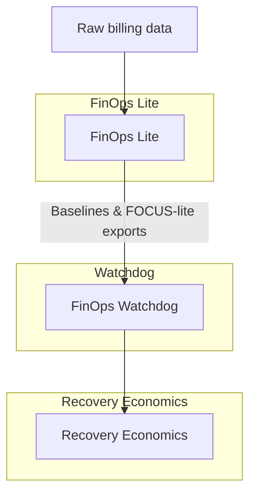

# FinOps Watchdog

**Baseline-aware cost change detection built on FinOps Lite**

[](https://github.com/dianuhs/finops-watchdog/actions/workflows/ci.yml)
[](https://www.python.org/downloads/)
[](https://opensource.org/licenses/MIT)
[](https://github.com/psf/black)

> Detect meaningful cloud cost changes relative to known baselines — clearly, deterministically, and with context.

---

## Why FinOps Watchdog Exists

Most cloud cost tools optimize for **visibility** or **real-time alerting**.

AWS Cost Explorer shows historical spend.  
AWS Budgets enforce static thresholds.  
AWS Cost Anomaly Detection applies statistical models that often lack operational grounding.

What’s missing is a calm, review-oriented layer that answers a more practical question:

> Given what we already understand about our costs, what actually changed — and is it worth attention?

FinOps Watchdog exists to support **reasoned review**, not reactive alerts.  
It assumes context already exists and uses that context as the baseline for detecting change.

---

## How Watchdog Fits

FinOps Watchdog is designed as the **second layer** in a deliberately separated FinOps stack:

- **FinOps Lite** → establishes cost structure and baseline truth  
- **FinOps Watchdog** → detects and interprets meaningful change  
- **Recovery Economics** → connects cost behavior to value, risk, and recovery decisions  

FinOps Lite answers *“what is true about our spend.”*  
Watchdog answers *“what is different, relative to what we already know.”*

---

## Architecture at a Glance



- **FinOps Lite** normalizes billing data and emits baseline views and FOCUS-lite exports.  
- **Watchdog** consumes those exports and focuses on change against baseline.  
- **Recovery Economics** takes behavior from Watchdog and connects it to value, risk, and recovery trade-offs.

---

## What Watchdog Does (and What It Doesn’t)

### What it does
- Compares current spend against **explicit historical baselines**
- Detects **service-level deviations** relative to recent behavior
- Classifies change as spikes, drops, drift, or new spend
- Produces findings that are deterministic, reproducible, and traceable
- Prints **human-readable interpretations** designed for review workflows

### What it does not do
- It does not query AWS Cost Explorer directly
- It does not use opaque anomaly scoring or black-box models
- It does not guess intent
- It does not generate dashboards or alerts

If a change cannot be explained in plain terms, it is not flagged.

---

## Input Contract (Explicit by Design)

FinOps Watchdog consumes **outputs produced by FinOps Lite**.

These typically include:
- rolling cost overviews
- service-level daily spend
- optional FOCUS-lite CSV exports

Because Watchdog never pulls raw billing data itself, every run is deterministic, testable, and reproducible.  
The same inputs will always produce the same findings.

---

## CLI Overview

Watchdog is a small, opinionated CLI that expects pre-computed exports.

Basic usage:

```bash
finops export watchdog --days 30 --output-dir outputs/latest

finops-watchdog analyze   --input outputs/latest   --baseline-window 30   --min-delta-amount 50   --min-delta-percent 0.25   --severity-threshold medium   --format text
```

### Key flags

| Flag                | Type     | Default   | Description |
|---------------------|----------|-----------|-------------|
| `--input`           | path     | required  | Directory containing FinOps Lite exports. |
| `--baseline-window` | integer  | `30`      | Number of trailing days to treat as the baseline window. |
| `--min-delta-amount`| float    | `0`       | Minimum absolute daily delta (in currency units) required before a change is considered. |
| `--min-delta-percent` | float  | `0.0`     | Minimum relative delta (e.g. `0.25` = 25%) required before a change is considered. |
| `--severity-threshold` | choice | `medium` | Minimum severity level to include in the output (`low`, `medium`, `high`). |
| `--format`          | choice   | `text`    | Output format (`text` for human review, `json` for automation). |
| `--output`          | path     | `-`       | Optional path to write results; defaults to stdout. |

These flags are intentionally small in number and tuned for review workflows:  
you set a baseline window, choose how sensitive you want the detector to be, and decide how you want the results rendered.

> If you are designing the CLI, these flags can serve as the stable surface area; internal implementation details are free to evolve without breaking calling patterns.

---

## Example Finding

```text
[HIGH] AmazonEC2 — spike

Current:   $180.00 / day
Baseline:  $105.00 / day
Delta:     +$75.00 (71.4%)

Interpretation:
Sustained increase relative to recent baseline.
Likely capacity or usage expansion rather than transient noise.
```

Findings are intentionally concise, reviewable, and designed to support human judgment.

---

## Typical Review Cadence

Watchdog is typically run on a **scheduled review cadence**, not continuously:

- weekly FinOps review with engineering leads
- pre-change freeze checks before major releases
- monthly cost review with finance / leadership

Because inputs are exported snapshots, you can re-run historical periods to reproduce findings as governance or audit needs evolve.

---

## License

MIT License — see [LICENSE](LICENSE)
