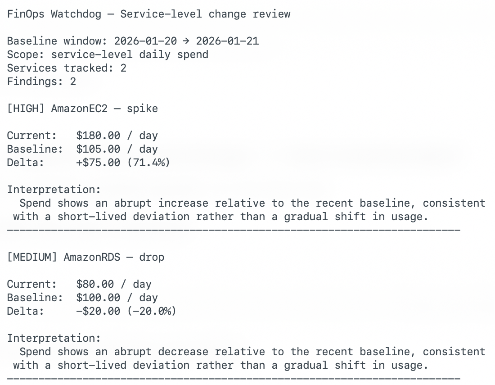

# FinOps Watchdog

**Baseline-aware cost change detection built on FinOps Lite**

[](https://github.com/dianuhs/finops-watchdog/actions/workflows/ci.yml)
[](https://www.python.org/downloads/)
[](https://opensource.org/licenses/MIT)
[](https://github.com/psf/black)

> Detect meaningful cloud cost changes relative to known baselines — clearly, deterministically, and with context.

---

## Overview

FinOps Watchdog is a cost change detection tool designed to sit **on top of FinOps Lite**.

It does not ingest raw billing data.  
It does not rely on opaque statistical models.  
It does not generate dashboards.

Instead, Watchdog consumes **explicit, explainable cost outputs** from FinOps Lite and answers a narrower, more operational question:

> Given what we already understand about our costs, what changed — and which changes deserve attention?

The result is a tool suited for FinOps reviews, automated checks, and post-incident analysis where clarity and traceability matter.

---

## How It Fits

FinOps Watchdog is the second layer in a deliberately separated stack:

- **FinOps Lite** → cost structure and reasoning  
- **FinOps Watchdog** → change detection and guardrails  
- **Recovery Economics (next)** → cost-to-value decisions  

FinOps Lite establishes *what is true*.  
Watchdog highlights *what is different*.

This separation keeps change detection focused, auditable, and easy to reason about.

---

## What Watchdog Does

- Compares current spend to explicit historical baselines
- Detects service-level deviations relative to recent behavior
- Classifies changes as spikes, drops, drift, or new spend
- Produces findings that are inspectable and reproducible
- Prints human-readable interpretations designed for review, not alerts alone

Every finding is grounded in:
- a known time window  
- a known service breakdown  
- a known baseline  

If a change can’t be explained, it isn’t flagged.

---

## Input Contract

FinOps Watchdog does **not** query AWS Cost Explorer directly.

It consumes outputs produced by FinOps Lite, including:

- time-window cost overviews  
- service-level daily spend  
- optional FOCUS-lite CSVs  

This makes Watchdog deterministic, testable, and automation-ready.

### Example Layout

```text
finops-lite/
  outputs/
    2026-01-20/
      overview.csv
      services.csv
      focus-lite.csv

finops-watchdog/
  inputs/
    latest -> ../finops-lite/outputs/2026-01-20/
```

---

## Example Finding

```text
[HIGH] AmazonEC2 — spike

Current:   $180.00 / day
Baseline:  $105.00 / day
Delta:     +$75.00 (71.4%)

Interpretation:
Spend shows an abrupt increase relative to the recent baseline, consistent
with a short-lived deviation rather than a gradual shift in usage.
```

This is the unit of output Watchdog is optimized for.

---

## What It Looks Like

*Service-level change detection with clear baselines and interpretation*



---

## Usage

```bash
# Run FinOps Lite first
finops cost overview --days 30
finops cost services --days 30

# Analyze changes with Watchdog
finops-watchdog analyze --input ./finops-lite/outputs/latest
```

Watchdog exits with a non-zero status code when material changes are detected, making it suitable for CI, cron jobs, and automated checks.

---

## Design Principles

- Explainability over cleverness  
- Explicit baselines over heuristics  
- Practitioner control over abstraction  
- Reasoning before reaction  

---

## Versioning

**Current version: v0.3**

This release formalizes Watchdog as a baseline-aware, FinOps-native change detection layer built on FinOps Lite outputs.

---

## Roadmap

**Now**
- Service-level baseline comparisons  
- Spike, drop, and drift classification  
- CLI-first, automation-friendly output  

**Next**
- Persistence-aware baselines  
- Optional notification hooks  
- Shared schema contracts with FinOps Lite  

**Later**
- Recovery Economics workflows  
- Cost change classification tied to deployments or incidents  

---

## Development

```bash
git clone https://github.com/dianuhs/finops-watchdog.git
cd finops-watchdog
pip install -e .[dev]

pytest
black finops_watchdog/
flake8 finops_watchdog/
```

---

## License

MIT License — see [LICENSE](LICENSE)

---

FinOps Watchdog exists because cost visibility without change awareness is incomplete.

It does not compete for attention.  
It adds context — exactly where FinOps decisions are made.

