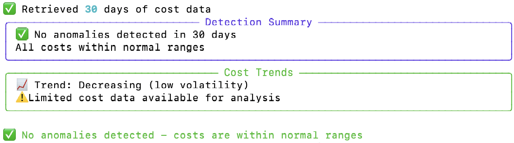

# FinOps Watchdog

**Baseline-aware cost change detection built on FinOps Lite**

[](https://github.com/dianuhs/finops-watchdog/actions/workflows/ci.yml)
[](https://www.python.org/downloads/)
[](https://opensource.org/licenses/MIT)
[](https://github.com/psf/black)

> Detect meaningful cloud cost changes relative to known baselines — not opaque models.

---

## Overview

FinOps Watchdog is a cost change detection tool designed to sit **on top of FinOps Lite**.

It does not pull raw billing data.  
It does not rely on black-box anomaly models.  
It does not generate dashboards.

Instead, Watchdog consumes **deterministic, explainable cost outputs** from FinOps Lite and answers a narrower, more practical question:

> Given what we already know about our costs, what changed — and which changes deserve attention?

This makes Watchdog suitable for FinOps reviews, automation, and post-incident analysis where explainability matters.

---

## How It Fits

FinOps Watchdog is the second layer in a deliberate stack:

- **FinOps Lite** → cost truth and reasoning  
- **FinOps Watchdog** → change detection and guardrails  
- **Recovery Economics (future)** → cost-to-value decisions  

The separation is intentional.

FinOps Lite establishes *what is true*.  
Watchdog highlights *what is different*.

---

## What Watchdog Does

- Compares current spend to explicit historical baselines
- Detects deviations relative to what is already considered normal
- Attributes changes to services, regions, or accounts
- Distinguishes one-time spikes from sustained drift
- Produces findings that are inspectable, auditable, and reproducible

Every finding can be traced back to:
- a known cost window
- a known breakdown
- a known baseline

If it can’t be explained, it isn’t flagged.

---

## What Watchdog Does Not Do

- No dashboards
- No vendor workflows
- No “AI-powered” claims
- No opaque anomaly scores

This tool is built for practitioners who want to understand *why* spend changed — not just that it did.

---

## Why Not Just Use AWS Budgets or Cost Anomaly Detection?

AWS tools are optimized for AWS’s perspective:

- **Budgets** rely on static thresholds  
- **Anomaly Detection** uses opaque statistical models  
- Attribution is limited  
- Post-hoc auditability is weak  

They are useful guardrails, but they do not explain change.

Watchdog is optimized for FinOps workflows:

- baselines you can inspect
- windows you define explicitly
- deltas you can reason about
- findings you can defend in a review or post-mortem

AWS may tell you *that* something is anomalous.  
Watchdog tells you *what changed, where, and relative to what*.

---

## Input Contract (Required)

FinOps Watchdog **does not** query AWS Cost Explorer directly.

It consumes outputs produced by FinOps Lite, such as:

- cost overviews (time-window totals)
- service-level breakdowns
- FOCUS-aligned (FOCUS-lite) CSV exports

This makes Watchdog deterministic, testable, and automation-ready.

### Example Layout

```text
finops-lite/
  outputs/
    2026-01-20/
      overview.csv
      services.csv
      focus-lite.csv

finops-watchdog/
  inputs/
    latest -> ../finops-lite/outputs/2026-01-20/
```

---

## Example Finding

```text
EC2 spend increased +$47.82 (+37%) versus the prior 14-day baseline.
82% of the increase is concentrated in us-east-1.
Change began 2 days ago and persists.
```

This is the unit of output Watchdog optimizes for.

---

## What It Looks Like

*Explainable change detection with clear attribution*  


*CLI-first workflow designed for automation*  


*Trend context to distinguish spikes from drift*  


---

## Usage

```bash
# Run FinOps Lite first
finops cost overview --days 30
finops cost services --days 30

# Analyze changes using Watchdog
finops-watchdog analyze --input ./finops-lite/outputs/latest
```

Watchdog exits with non-zero codes when actionable changes are detected, making it suitable for CI, cron jobs, and automated checks.

---

## Design Principles

- Explainability over cleverness  
- Baselines over heuristics  
- Practitioner control over vendor abstraction  
- Reasoning before reaction  

---

## Versioning

**Current version: v0.2**

This release formalizes Watchdog as a second-layer tool that depends on FinOps Lite outputs.

Future versions will deepen attribution and baseline strategies — not add dashboards or black-box models.

---

## Roadmap

**Now**
- Baseline-aware change detection
- Service-level attribution
- CLI-first automation support

**Next**
- Weekday-aware and persistence-based baselines
- Optional notification hooks (Slack, email)
- Shared schema contracts with FinOps Lite

**Later**
- Recovery Economics workflows (cost → value)
- Change classification tied to deployments or incidents

---

## Development

```bash
git clone https://github.com/dianuhs/finops-watchdog.git
cd finops-watchdog
pip install -e .[dev]

pytest
black finops_watchdog/
flake8 finops_watchdog/
```

---

## License

MIT License — see [LICENSE](LICENSE)

---

FinOps Watchdog exists because cost visibility without change awareness is incomplete.

It does not replace AWS tools.  
It sits above them — closer to how FinOps decisions are actually made.
